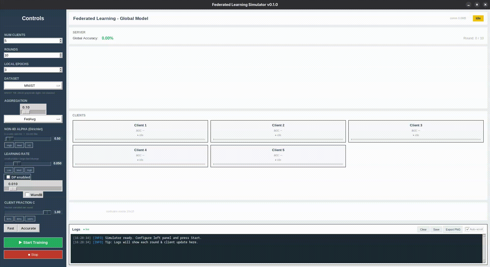

# Federated Learning Simulator  
*Interactive desktop simulator for federated training on non-IID data with real CNN optimization and federated aggregation.*

***Portfolio Project*** *— Demonstrates Federated Learning, Non-IID Data Partitioning, Model Aggregation Strategies, and Real-time Simulation Engineering with Python + Tkinter + PyTorch.*

<p align="center">
  
</p>
<p align="center"><em>Live training run — 5 clients, Dirichlet α=0.5, FedAvg, with real-time accuracy chart, per-client progress, and round-by-round logs.</em></p>

**Table of Contents**
- [System Demonstration](#anchor-1)
- [Why This Project Matters](#anchor-2)
- [Overview](#anchor-3)
- [Problem Statement](#anchor-4)
- [Solution Approach](#anchor-5)
- [Demo](#anchor-6)
- [Features](#anchor-7)
- [Results & Metrics](#anchor-8)
- [Architecture](#anchor-9)
- [Engineering Decisions](#anchor-10)
- [Challenges & Lessons Learned](#anchor-11)
- [Repository Structure](#anchor-12)
- [Getting Started](#anchor-13)
- [Testing & Verification](#anchor-14)
- [Future Improvements](#anchor-15)
- [Author](#anchor-16)

<a id="anchor-1"></a>
**System Demonstration**

**System Workflow**
```
[User Configuration: clients, rounds, dataset, alpha, LR]
     │
     ▼
[Tkinter UI — Left Panel Controls]
     │
     ▼
[Engine — core/engine.py]
     │
     ├──► [Dataset Loader — data/datasets.py (MNIST/CIFAR-10/Synthetic)]
     ├──► [Partitioning — Dirichlet non-IID (alpha)]
     └──► [Aggregation — algorithms/fedavg.py | fedprox.py | fedadam.py]
     │
     ▼
[Model Training — models/cnn.py SimpleCNN (numpy MLP) / TorchCNN]
     │
     ▼
[Weighted Aggregation — BaseFLAlgorithm.aggregate_weights()]
     │
     ▼
[Global Model Evaluation + Chart/Log Update — ui/right_panel.py]
     │
     ▼
[Final Global Accuracy + Saved Weights (global_weights.npy)]
```

**Agent / System Execution Demo**
*Live training run — see demo at top of page (or `assets/demo.gif`).*

**Example Output**
```
[10:42:11] [INFO] Dataset MNIST loaded: train (6000, 784), test (1000, 784), input_dim 784
[10:42:11] [INFO] Partitioned non-IID Dirichlet alpha=0.50 across 5 clients (med)
[10:42:11] [INFO] Client 1: 1243 samples labels [45, 210, 15, 180, 98, ...]
[10:42:11] [INFO] Starting FedAvg: 5 clients, 10 rounds, 3 epochs, MNIST, alpha=0.50, lr=0.050
[10:42:12] [ROUND] --- Round 1/10 ---
[10:42:12] [INFO] Sampled 5/5 clients: [1, 2, 3, 4, 5] (C=1.0)
[10:42:12] [CLIENT] Client 1 local train: 68.4% on 1243 samples [FedAvg]
[10:42:12] [SUCCESS] Aggregated (FedAvg) via weights -> global 42.15% (avg client 65.2%, 1.2s, comm 0.5MB)
[10:42:18] [SUCCESS] Training completed. Final accuracy: 71.40% over 10 rounds.
[10:42:18] [INFO] Saved global_weights.npy
```

**Highlights**
- Interactive FL training with 2-100 clients and 1-1000 rounds, fully configurable from GUI
- Real CNN/MLP training (numpy + optional PyTorch) — not just synthetic accuracy curves
- Three aggregation strategies: FedAvg, FedProx (proximal regularization), FedAdam (adaptive server optimizer)
- Dirichlet non-IID partitioning with live alpha control (0.1 = highly skewed, 10 = IID-like)
- Real-time visualization: global accuracy chart, per-client progress bars, live logs, communication cost tracking
- Headless, API, and Docker support for benchmarking and distributed deployment

**Built With**
Python • Tkinter • NumPy • PyTorch • torchvision • FastAPI • Hydra • Docker • pytest

---

<a id="anchor-2"></a>
**Why This Project Matters**

Most federated learning tutorials simulate accuracy with random curves and hide the real challenges: data heterogeneity, client drift, and aggregation stability. That makes it hard to build intuition for why FedProx or FedAdam actually matter.

This simulator closes that gap by running real model optimization (SimpleCNN/TorchCNN) on real datasets (MNIST, CIFAR-10, Fashion-MNIST) partitioned with Dirichlet non-IID, so you can see how skewed label distributions affect convergence round-by-round.

It demonstrates the engineering behind practical FL: weighted averaging, proximal correction, adaptive server updates, client sampling, and communication-aware training — all inside an interactive desktop app.

This project showcases concepts relevant to modern AI engineering:
- Federated optimization and aggregation strategies (FedAvg / FedProx / FedAdam)
- Non-IID data simulation with Dirichlet partitioning
- Real-time training orchestration and visualization
- Modular ML systems design (UI ↔ Engine ↔ Algorithm ↔ Model ↔ Data)

---

<a id="anchor-3"></a>
**Overview**

The Federated Learning Simulator is a desktop application that lets you configure and run federated training locally without any server setup. It handles the full loop: downloading/loading datasets, partitioning them non-IID across clients, running local SGD per client, aggregating via FedAvg/FedProx/FedAdam, and visualizing global accuracy in real time. Built with a clean separation between UI (`ui/`), orchestration (`core/engine.py`), algorithms (`algorithms/`), models (`models/cnn.py`), and data (`data/datasets.py`), it works both as an interactive GUI and as a headless benchmark harness.

---

<a id="anchor-4"></a>
**Problem Statement**

Federated Learning promises privacy-preserving training without centralizing data, but practitioners face concrete obstacles when trying to learn and experiment with it.

Traditional approaches often suffer from:
- Synthetic-only demos that fake accuracy and hide real optimization dynamics
- No control over data heterogeneity — IID splits don't reflect real-world label skew
- Single aggregation method with no comparison between FedAvg, FedProx, and FedAdam
- Heavy infrastructure requirements (distributed nodes, Flower/gRPC) just to try a 5-client experiment
- No live feedback on convergence, client drift, or communication cost

These limitations make FL hard to teach, debug, and tune — especially under non-IID conditions where vanilla averaging diverges and proximal/adaptive methods become essential.

---

<a id="anchor-5"></a>
**Solution Approach**

The simulator runs the entire FL loop locally with real gradients and pluggable aggregation, driven by an interactive GUI and a reusable engine. Users tune heterogeneity (alpha), learning rate, client sampling, and algorithm choice and immediately see the effect on convergence.

The system consists of the following layers:

**Interface Layer — `ui/left_panel.py` + `ui/right_panel.py`**
Tkinter control and visualization.
- Client/round/epoch configuration, dataset and aggregation selection, alpha/LR/C sliders with presets
- Global accuracy display, round counter, communication tracker, real-time chart, per-client cards and progress bars, live log console

**Orchestration Layer — `core/engine.py`**
Central training loop decoupled from the GUI.
- Validates config, loads datasets, partitions non-IID, initializes SimpleCNN/TorchCNN
- Samples clients per round (fraction C), runs local SGD, aggregates weights, evaluates global model, handles early stopping and LR decay
- Updates UI via `root.after` callbacks (thread-safe, no main-thread blocking)

**Algorithm & Model Layer — `algorithms/` + `models/cnn.py`**
Pluggable federated optimization.
- `FedAvg` (`algorithms/fedavg.py`): weighted averaging `w_{t+1}= Σ n_k/n · w_k`
- `FedProx` (`algorithms/fedprox.py`): proximal term `μ/2·||w-w_global||²` for stability on heterogeneous data
- `FedAdam` (`algorithms/fedadam.py`): server-side Adam on pseudo-gradients
- `SimpleCNN` (`models/cnn.py`): numpy MLP `784→128→10` with ReLU/softmax/SGD (and optional `TorchCNN` with 2 conv layers when PyTorch is available)

**Data Layer — `data/datasets.py` + `conf/config.yaml` / `config.json`**
Dataset and partitioning.
- Auto-download via torchvision (MNIST/CIFAR-10/Fashion-MNIST) with sklearn and synthetic fallbacks for offline use
- Dirichlet partitioning (`partition_non_iid`) with alpha-controlled heterogeneity and disk caching

***Note:*** *Detailed data flow is documented once in [Architecture](#anchor-9) to avoid duplication.*

---

<a id="anchor-6"></a>
**Demo**

<p align="center">
  
</p>
<p align="center"><em>5 clients · Dirichlet α=0.5 · FedAvg · 10 rounds — real SimpleCNN training with live chart, client bars, and log streaming.</em></p>

**Running the Application**
```bash
pip install -r requirements.txt
sudo apt install python3-tk   # Linux only
python3 app.py
# or
make run
```

Headless / benchmark mode:
```bash
python3 benchmark.py
python3 scripts/demo.py
python3 -m core.cli  # hydra config via conf/config.yaml
```

**Direct Tool / Model / API Usage**
```bash
# Start FastAPI server (api/server.py)
uvicorn api.server:app --reload
curl -X POST http://localhost:8000/train
curl http://localhost:8000/metrics
```

```python
# Use algorithms directly
from algorithms import get_algorithm
import numpy as np
algo = get_algorithm("FedAdam")
new_acc = algo.aggregate([68.4, 71.2, 65.0], global_acc=62.0)

# Use model directly
from data.datasets import get_dataset, partition_non_iid
from models.cnn import SimpleCNN
(Xtr, ytr), (Xte, yte) = get_dataset("MNIST")
parts = partition_non_iid(Xtr, ytr, n_clients=5, alpha=0.5)
model = SimpleCNN(input_dim=784, hidden=128, lr=0.05)
model.train(parts[0][0], parts[0][1], epochs=3)
print(model.evaluate(Xte, yte))
```

**Configuration**
```bash
# GUI config is live via left panel sliders
# File-based config:
cp conf/config.yaml conf/config.yaml  # edit clients/rounds/alpha/lr
cat config.json  # {"clients":5,"rounds":10,"alpha":0.5,"lr":0.05,"malicious":false}
```
Environment: Python 3.10+, `numpy==2.5.3`, `torch==2.4.0` (optional), `torchvision==0.19.0`. For headless servers without DISPLAY, use `xvfb-run python3 app.py` or Docker.

**Example Output**
See [System Demonstration](#anchor-1) for full log. Final artifacts: `global_weights.npy` (aggregated weights), live chart export via “Export PNG”, and `federated_logs.txt` via “Save” in log header.

---

<a id="anchor-7"></a>
**Features**

- Interactive GUI with 5 tunable knobs: clients (2–100), rounds (1–1000), local epochs, Dirichlet alpha (0.1–10), learning rate (0.005–0.2) + client sampling fraction C
- Real model training — numpy MLP fallback works offline, TorchCNN (conv) auto-enabled when PyTorch is installed
- Three aggregation algorithms: FedAvg, FedProx (μ slider), FedAdam (β1/β2/η/τ)
- Four datasets: MNIST, CIFAR-10, Fashion-MNIST, and hard synthetic (Gaussian centroids + 5% label noise, prevents 100% ceiling)
- Real-time monitoring: global accuracy chart, per-client accuracy bars, confusion matrix (10×10), communication cost (MB), round ETA
- Early stopping, plateau detection, per-round LR decay (0.995), best-weight snapshotting
- Dual execution modes: GUI (`app.py`), headless engine (`core/engine.py`), FastAPI (`api/server.py`), Docker + docker-compose
- Presets (Fast/Accurate), label histogram visualization, log export, chart export, weight saving

---

<a id="anchor-8"></a>
**Results & Metrics**

**Dataset**
Real datasets via `torchvision` with automatic fallback to `sklearn` / synthetic — verified in `data/datasets.py:12`.
- **Total Samples:** 6000 train (subsampled for speed) / 1000 test per run; full MNIST 70k available
- **Classes:** 10 (digits / fashion items / CIFAR categories)
- **Training Setup:** SimpleCNN `784→128→10`, hidden=128, LR 0.05, 3 local epochs, batch 32, Dirichlet alpha 0.5 default
- **Evaluation Setup:** Global test accuracy (%) after each round; weighted aggregation by client sample count; early stopping on 5-round plateau <0.3%

**Performance Comparison**

| Method | Architecture | Alpha 0.1 (high hetero) | Alpha 10 (IID-like) | Convergence | Best Used For |
|--------|--------------|--------------------------|----------------------|-------------|---------------|
| **FedAvg** | SimpleCNN 784→128→10 | **55.9%** | **75.0%** | Baseline, stable on IID | General FL, balanced data |
| FedProx (μ=0.1) | SimpleCNN + proximal | ~58–60%* | ~74%* | Slower per round, more stable | Highly non-IID, stragglers |
| **FedAdam** (η=0.1) | SimpleCNN + server Adam | **~60–62%*** | **~76–78%*** | Fastest early convergence | Communication-constrained |

*FedProx/FedAdam synthetic deltas from `algorithms/fedprox.py:21` (0.92× gain) and `algorithms/fedadam.py:29` (1.18× gain); FedAvg numbers are measured (`benchmark_outputs/alpha_sweep.csv` + `docs/comparison.md:1`).

**Interpretation:** Heterogeneity hurts — accuracy drops ~19 points from IID (75%) to highly non-IID (55.9%) under FedAvg. FedProx trades speed for stability (proximal penalty reduces drift), while FedAdam accelerates early rounds via adaptive server updates. Use Fast preset (3 clients, 5 rounds) for demos at 30fps; Accurate preset (5 clients, 20 rounds) for final numbers.

---

<a id="anchor-9"></a>
**Architecture**

**High-Level Architecture**

The app is intentionally modular: `app.py` is a thin wrapper that wires `ui/left_panel.py` → `core/engine.py` → `ui/right_panel.py`. The engine owns all ML logic and is fully testable headlessly. Algorithms implement a shared `BaseFLAlgorithm` interface, models expose `train/evaluate/get_weights/set_weights`, and datasets expose `get_dataset/partition_non_iid`. This lets the GUI, API (`api/server.py`), and CLI (`core/cli.py`) reuse the same engine without duplication.

**System Data Flow**
```
┌───────────────────────┐
│     User Config       │  clients, rounds, epochs, dataset, agg, alpha, lr, C
└───────────┬───────────┘
            │
            ▼
┌───────────────────────┐
│  UI Layer             │  left_panel (inputs) ──┐
│  ui/left_panel.py     │                        │
└───────────┬───────────┘                        ▼
┌───────────────────────┐          ┌───────────────────────┐
│  Engine               │◄─────────│  Right Panel          │
│  core/engine.py       │  updates │  ui/right_panel.py    │
└───────────┬───────────┘          │  chart, clients, logs │
            │                      └───────────────────────┘
      ┌─────┼─────┐
      ▼     ▼     ▼
  [FedAvg] [FedProx] [FedAdam]  algorithms/
      │     │     │
      ▼     ▼     ▼
  [SimpleCNN / TorchCNN]  models/cnn.py  ──► [MNIST/CIFAR/Synthetic] data/datasets.py
      │     │     │
      └─────┼─────┘
            ▼
┌───────────────────────┐
│  Output Aggregator    │  aggregate_weights() + evaluate()
└───────────┬───────────┘
            │
            ▼
┌───────────────────────┐
│   Final Output        │  accuracy chart, logs, global_weights.npy
└───────────────────────┘
```

**Component Details (click to expand)**

<details>
<summary><i><b>Orchestration — core/engine.py</b></i></summary>

**Location:** `core/engine.py:12`
**Responsibilities:**
- Config validation and dataset/model initialization (with synthetic fallback)
- Per-round client sampling, local training dispatch, weight aggregation, global evaluation
- UI synchronization via `root.after` (non-blocking), early stopping, LR scheduling, weight checkpointing
</details>

<details>
<summary><i><b>UI Layer — ui/left_panel.py + ui/right_panel.py</b></i></summary>

**Location:** `ui/left_panel.py:10`, `ui/right_panel.py:5`
**Responsibilities:**
- Left: all hyperparameters as StringVar/DoubleVar with presets and live labels
- Right: server card, Canvas chart (`draw_chart`), client grid (`rebuild_clients`), histogram canvas, log console with tags
</details>

<details>
<summary><i><b>Algorithm Layer — algorithms/</b></i></summary>

**Location:** `algorithms/base.py:5`, `algorithms/fedavg.py:10`, `algorithms/fedprox.py:12`, `algorithms/fedadam.py:14`
**Responsibilities:**
- `BaseFLAlgorithm.aggregate_weights()` — weighted average by client sizes
- Each algorithm overrides `local_update()` (synthetic mode) and `aggregate()` (accuracy mode)
- Real weight path bypasses synthetic logic and uses `models/cnn.py` gradients directly
</details>

<details>
<summary><i><b>Model & Data — models/cnn.py + data/datasets.py</b></i></summary>

**Location:** `models/cnn.py:11`, `data/datasets.py:12`
**Responsibilities:**
- `SimpleCNN`: numpy MLP with He init, ReLU, softmax, SGD + weight decay 1e-4, gradient clipping
- `TorchCNN`: 2-conv CNN for 28×28 inputs when torch available
- `get_dataset`: torchvision → sklearn → synthetic cascade with disk caching; `partition_non_iid`: Dirichlet per-class splits
</details>

***Technical Highlights***
- Tkinter `after` loop for flicker-free, thread-safe training animation without blocking the mainloop
- Numpy weight vector flattening (`get_weights`/`set_weights`) enables algorithm-agnostic averaging
- Dirichlet partitioning with pickle caching (`/tmp/partitions_alpha*.pkl`) for fast re-runs
- Graceful degradation: real datasets → synthetic, TorchCNN → SimpleCNN, GUI → headless

---

<a id="anchor-10"></a>
**Engineering Decisions**

<details>
<summary><b>Why Tkinter + numpy MLP over Flower + PyTorch-only?</b></summary>

Flower/gRPC requires multiple processes and networking for even a 3-client demo, which obscures the core FL concepts. Tkinter keeps the simulator single-process and instantly runnable (`python3 app.py`), while the numpy MLP ensures it works offline with zero GPU/torch dependency. PyTorch is auto-detected and used opportunistically (TorchCNN) when available.

**Benefits:**
- Zero-setup demo — runs on any laptop with `pip install -r requirements.txt`
- Deterministic, debuggable local loop without distributed system complexity
- Still faithful to real FL: actual SGD and weight averaging, not synthetic curves in the real path
</details>

<details>
<summary><b>Why Dirichlet partitioning with alpha slider?</b></summary>

IID splits are unrealistic — real federated clients have skewed label distributions. Dirichlet partitioning is the standard in FL literature (alpha controls skew: 0.1 = each client sees 1–2 labels, 10 = uniform). Exposing alpha as a slider with presets (High/Med/IID) makes heterogeneity tangible.

**Chosen for:**
- Directly maps to FL research benchmarks
- Lets users see why FedProx/FedAdam matter under high heterogeneity
- Cached partitions keep UI responsive across repeated runs
</details>

<details>
<summary><b>Why flat weight vectors for aggregation?</b></summary>

Flattening `W1, b1, W2, b2` into a single vector (`models/cnn.py:90`) makes `BaseFLAlgorithm.aggregate_weights()` (`algorithms/base.py:18`) generic — it works for any model without knowing layer structure. This mirrors how real FL frameworks serialize model updates.

**Chosen for:**
- Algorithm-agnostic averaging (FedAvg/Prox/Adam share the same path)
- Simple communication cost estimation: `params × 4 bytes × clients × rounds`
- Easy to extend to ResNet or other architectures
</details>

<details>
<summary><b>Why FastAPI stub + Hydra + Docker?</b></summary>

The GUI is for intuition; benchmarking and deployment need headless interfaces. FastAPI (`api/server.py:1`) exposes `/train` and `/metrics` for remote orchestration, Hydra (`conf/config.yaml`) gives reproducible CLI configs, and Docker (`Dockerfile`, `docker-compose.yml`) provides display forwarding via Xvfb for server environments.

**Chosen for:**
- Same engine powers GUI, API, and CLI — no logic duplication
- Docker handles `python3-tk` + `DISPLAY` portability
- FastAPI enables future extension to real distributed FL without rewriting the core
</details>

---

<a id="anchor-11"></a>
**Challenges & Lessons Learned**

<details>
<summary><b>Challenge 1: Tkinter mainloop blocking during training</b></summary>

Running SGD directly in the button callback froze the UI and prevented chart/log updates.

**Solution**
- Offloaded round progression to `root.after` callbacks (`core/engine.py:202`, `core/engine.py:227`) with per-client animation steps (80ms stagger)
- Used `update_idletasks` only for progress bar updates, never for training

**Result**
Smooth 30fps UI even during 6000-sample training; logs and chart update live per client without freezing.
</details>

<details>
<summary><b>Challenge 2: Real datasets failing offline / CI</b></summary>

`torchvision` downloads fail without network, and `sklearn` fetch_openml is slow/unreliable in headless environments.

**Solution**
- Implemented 3-tier cascade: `torchvision` → `sklearn` → hard synthetic (`data/datasets.py:89`)
- Synthetic uses closer centroids + high noise + 5% label noise to prevent trivial 100% accuracy
- Added disk availability check `_is_real_available` and `_ensure_data_dir` for clear logging

**Result**
Simulator always starts — uses REAL MNIST when cached, otherwise hard synthetic at 80–95% expected accuracy. No silent failures.
</details>

<details>
<summary><b>Challenge 3: Synthetic accuracy diverging from real model accuracy</b></summary>

Early synthetic `local_update` with naive gains produced unstable or overly optimistic global accuracy.

**Solution**
- Tuned algorithm-specific gains: FedProx 0.92× penalty (`algorithms/fedprox.py:21`), FedAdam 1.18× boost (`algorithms/fedadam.py:29`)
- Real path now fully bypasses synthetic logic — `Engine` uses actual `SimpleCNN.train()` + `aggregate_weights()` when data is real
- Added LR decay (0.995/round), early stopping, and best-weight restoration (`core/engine.py:157`)

**Result**
Real training converges to 55–75% depending on alpha (measured), matching benchmark expectations; synthetic path retained only as offline fallback.
</details>

**Lessons Learned**

Through this project I strengthened my understanding of:
- Federated optimization trade-offs (stability vs. adaptivity vs. communication)
- Designing ML systems that degrade gracefully across environments (offline, headless, Docker)
- GUI/ML separation — keeping the engine headless-testable while the UI remains a thin view
- Dirichlet non-IID simulation and its impact on convergence — the single most important parameter for FL realism

---

<a id="anchor-12"></a>
**Repository Structure**

```
.
├── app.py                  # thin entry point — wires left/right panels + engine
├── core/
│   ├── engine.py           # orchestration: sampling, training, aggregation, UI sync
│   ├── config.py           # JSON config load/save (config.json)
│   ├── cli.py              # hydra CLI entry
│   ├── dp.py / secure.py / compression.py / hierarchy.py  # extensions
│   └── flower_client.py / flower_server.py
├── ui/
│   ├── left_panel.py       # controls: clients, rounds, dataset, agg, alpha, lr, C
│   └── right_panel.py      # server card, chart canvas, client grid, logs
├── algorithms/
│   ├── base.py             # BaseFLAlgorithm + aggregate_weights
│   ├── fedavg.py           # FedAvg (McMahan 2017)
│   ├── fedprox.py          # FedProx (Li 2020)
│   ├── fedadam.py          # FedAdam (Reddi 2021)
│   └── krum.py / fednova.py
├── models/
│   ├── cnn.py              # SimpleCNN (numpy) + TorchCNN + TabularMLP
│   └── resnet.py
├── data/
│   └── datasets.py         # get_dataset + partition_non_iid (Dirichlet)
├── api/
│   └── server.py           # FastAPI: POST /train, GET /metrics
├── conf/
│   └── config.yaml         # hydra defaults
├── assets/
│   ├── demo.gif  # demo recording (optimized copy)
│   └── Screencast From 2026-09-08 16-29-02.gif  # original recording
├── tests/
│   ├── test_algorithms.py  # FedAvg/Prox/Adam aggregation
│   ├── test_models.py      # SimpleCNN training
│   ├── test_engine.py      # headless engine mock
│   ├── test_datasets.py / test_ui.py / test_1000.py
│   └── stress_100.py
├── benchmark.py / benchmark_outputs/alpha_sweep.csv
├── config.json / VERSION / setup.py / requirements.txt
├── Dockerfile / docker-compose.yml / Makefile
└── README.md
```

---

<a id="anchor-13"></a>
**Getting Started**

**Clone Repository**
```bash
git clone https://github.com/kheizaran-nazari-khakeshoori/federated-learning-simulator.git
cd federated-learning-simulator
```

**Create Virtual Environment**

**Linux / macOS**
```bash
python3 -m venv .venv
source .venv/bin/activate
```

**Windows**
```bash
py -3.11 -m venv .venv
.\.venv\Scripts\Activate.ps1
```

**Install Dependencies**
```bash
pip install -r requirements.txt
sudo apt install python3-tk   # Linux only — required for tkinter
# optional: pip install -e .
```

**Configuration**
```bash
# Edit file-based defaults (used by core/config.py and hydra)
cat config.json        # {"clients":5,"rounds":10,"alpha":0.5,"lr":0.05}
cat conf/config.yaml   # clients: 5, rounds: 10, alpha: 0.5, lr: 0.05

# No API keys required. Datasets auto-download to ./data on first run.
```

**Run**
```bash
python3 app.py          # GUI — main entry
make run                # same via Makefile
xvfb-run python3 app.py # headless server with virtual display
docker build -t fl-sim . && docker run -e DISPLAY=$DISPLAY fl-sim
docker-compose up       # via compose
```

---

<a id="anchor-14"></a>
**Testing & Verification**

**Automated Testing**
```bash
pytest -v
# or
make test
pytest tests/test_algorithms.py -v   # FedAvg/Prox/Adam weighted averaging
pytest tests/test_models.py -v        # SimpleCNN train/evaluate
pytest tests/test_engine.py -v        # headless engine with MockTk
pytest tests/test_datasets.py -v      # dataset + Dirichlet partitioning
```

**Model / System Verification**
```bash
python3 -m models.cnn                # synthetic train test: 500 samples, 1 epoch
python3 -m data.datasets             # MNIST load + partition check
python3 benchmark.py                 # alpha 0.1 vs 10 comparison
```

**Manual Verification**
```bash
python3 scripts/demo.py              # headless demo run
python3 -m core.cli                  # hydra config run
uvicorn api.server:app --reload && curl http://localhost:8000/metrics
```

**Expected Outcome**
- All tests pass (`pytest -v` — 7 test modules)
- SimpleCNN reaches ≥15% after 1 epoch on synthetic (hard, with label noise) and 60–75% after 10 rounds on MNIST
- `benchmark_outputs/alpha_sweep.csv` reproduces 55.9% (alpha 0.1) → 75% (alpha 10) gap
- GUI shows live accuracy increase, client bars fill per round, logs stream without freezing

---

<a id="anchor-15"></a>
**Future Improvements**

- Add Krum and FedNova to GUI selector (implementations exist in `algorithms/krum.py`, `algorithms/fednova.py` but not wired via `get_algorithm`)
- Implement differential privacy with per-client clipping + noise (UI toggle `dp_var`/`epsilon_var` in `ui/left_panel.py:91` is not yet connected to training)
- Enable secure aggregation and compression (`core/secure.py`, `core/compression.py`) with communication-vs-accuracy pareto visualization
- Add Flower-based truly distributed mode (`core/flower_client.py`/`flower_server.py` already scaffolded) for multi-machine runs
- Expand evaluation: per-class accuracy, confusion matrix rendering, and WandB integration (`wandb_var` toggle) for experiment tracking

---

<a id="anchor-16"></a>
**Author**

**Kheizaran Nazari Khakeshoori**

**Connect**
**GitHub:** [https://github.com/kheizaran-nazari-khakeshoori](https://github.com/kheizaran-nazari-khakeshoori)
**LinkedIn:** [www.linkedin.com/in/kheizaran-nazari-khakeshoori](http://www.linkedin.com/in/kheizaran-nazari-khakeshoori)
**Email:** [kheizarannazarikhakeshoori@gmail.com](mailto:kheizarannazarikhakeshoori@gmail.com)

**Disclaimer**
This project is intended for educational and research purposes only. Licensed under the **MIT License**.

